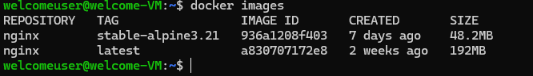

To Stop all the containers: 
```bash
docker stop $(docker ps -q)
```
To delete all the containers: 
```bash
docker rm $(docker ps -a -q)
```
To delete all the images:
```bash
docker rmi $(docker images -q)
```

List images:

```bash
docker images
```


