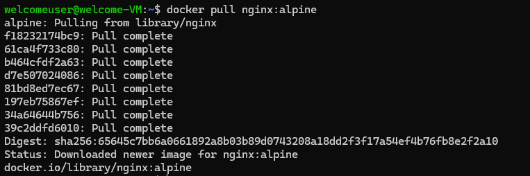
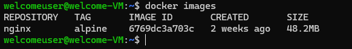
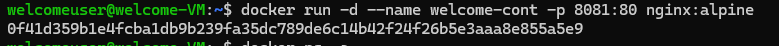
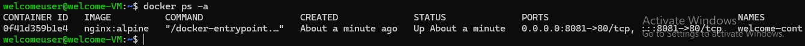

To Stop all the containers: 
```bash
docker stop $(docker ps -q)
```
To delete all the containers: 
```bash
docker rm $(docker ps -a -q)
```
To delete all the images:
```bash
docker rmi $(docker images -q)
```
create and pull image from dockerhub:


List images:
```bash
docker images
```


Create a container from image:
```bash
docker run -d --name welcome-cont -p 8081:80 nginx:alpine 
```



Lists all the container including running and existed:
```bash
docker ps -a 
```




